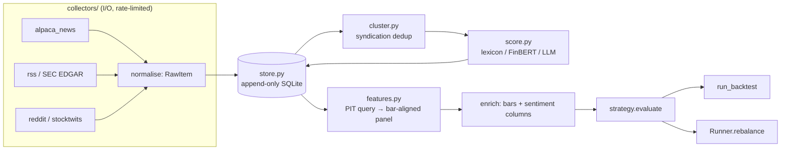

# Feed collector: live news + market sentiment

Design for adding a news/social feed collector and sentiment signal to the bar-driven
framework on `boto-bar-driven`. Status: **design, not built.**

## 1. The constraint everything else follows from

This framework's one real guarantee is that a backtest tests what actually trades:
signals are computed from information available at or before a bar's close, and the
one-bar execution lag lives in the backtester and the runner, never in the signal
(`strategy.py`, `test_no_lookahead`). A live-scraped sentiment feed is the easiest way
to silently destroy that guarantee, in four distinct ways:

| Failure | What it looks like |
|---|---|
| **Backfill leakage** | You scrape an archive today and stamp items with *publication* time. But you're seeing the corrected, de-duplicated, still-online version. Deleted posts and retracted stories are invisible; revised headlines read as if they were always that way. |
| **Model hindsight** | A sentiment model trained in 2026 scoring a 2020 headline knows how 2020 ended. The *text* is point-in-time; the *scorer* is not. |
| **Close-boundary leakage** | An 18:00 press release is not tradable on that day's close. Attributing it to that bar buys the gap for free. |
| **Syndication inflation** | One Reuters story republished by 50 outlets reads as 50× conviction. This alone can manufacture a beautiful, entirely fake backtest. |

So the design is built around one primitive: **`knowable_at`** — the timestamp at which
*this system* could first have acted on an item. Never publication time. Every feature
query is masked on `knowable_at <= bar_close`, and the mask is the only thing standing
between a future item and an earlier bar.

This is not a novel idea here — the `feat/vibe-trading-parity` branch already carries
exactly this discipline in `agent/backtest/loaders/rsshub_events.py` (a `knowable_date`
that rolls post-close publications to the next session) and tests it in
`agent/tests/test_rsshub_events_lookahead.py` with a stub provider that *deliberately
ignores* the as-of parameter, forcing the enricher's per-bar mask to be the only defense.
Reuse that pattern; it's proven and it's already in this repo.

**Honest consequence:** the day you turn this on, you have no history. Alpaca's news API
has a usable archive (§5) which gets you a real backtest for headlines; social sentiment
you must accumulate forward. Until you have accumulated it, a "backtest" of a social
signal is a research exercise, not evidence.

## 2. Architecture



New package `paper_trading_boto/feeds/`; everything else in the repo is untouched except
two call sites (§8).

## 3. Data model

Append-only. Rows are never updated in place — a corrected article is a *new* row with a
new `knowable_at`, which is what makes the history replayable.

```sql
CREATE TABLE items (
  id           TEXT PRIMARY KEY,   -- sha256(source, url, normalised title+body)
  source       TEXT NOT NULL,      -- 'alpaca', 'rss:reuters', 'reddit:wallstreetbets'
  url          TEXT,
  published_at TIMESTAMP NOT NULL, -- from the source. UNTRUSTED, never masked on.
  observed_at  TIMESTAMP NOT NULL, -- when WE fetched it. Monotonic, trusted.
  knowable_at  TIMESTAMP NOT NULL, -- max(published_at, observed_at), rolled past a
                                   -- post-close cutoff to the next session open.
  title        TEXT,
  body         TEXT,
  raw          TEXT                -- original payload, for reprocessing
);
CREATE INDEX items_knowable ON items(knowable_at);

CREATE TABLE mentions (
  item_id    TEXT NOT NULL REFERENCES items(id),
  symbol     TEXT NOT NULL,
  method     TEXT NOT NULL,        -- 'provider' | 'cashtag' | 'name_match'
  confidence REAL NOT NULL,
  PRIMARY KEY (item_id, symbol)
);

CREATE TABLE clusters (            -- syndication grouping
  item_id    TEXT PRIMARY KEY REFERENCES items(id),
  cluster_id TEXT NOT NULL,
  is_primary INTEGER NOT NULL      -- earliest knowable_at in the cluster
);

CREATE TABLE scores (
  item_id   TEXT NOT NULL REFERENCES items(id),
  model     TEXT NOT NULL,         -- 'vader-3.3.2', 'finbert-prosus', 'claude-haiku-4-5'
  score     REAL NOT NULL,         -- [-1, +1]
  confidence REAL,
  scored_at TIMESTAMP NOT NULL,    -- part of the PIT gate — see below
  PRIMARY KEY (item_id, model)
);
```

Two subtleties worth stating explicitly:

- **`knowable_at` is `max(published_at, observed_at)`, then rolled.** Taking the max
  defends against a source backdating an item; the roll handles the close boundary. A
  16:05 ET item is knowable at the *next* session's open, not today's close.
- **`scored_at` is part of the gate, not metadata.** If you re-score three years of
  archive with a new model today, every one of those scores has `scored_at = today`. The
  feature query must use `effective_at = max(knowable_at, scored_at)`, or you have
  reintroduced model hindsight through the back door. The only clean escape is a scorer
  you can certify as time-invariant (a frozen lexicon), for which you may set
  `scored_at = knowable_at` — and that certification is a decision to make deliberately,
  per model, not a default.

## 4. Collector interface

```python
@dataclass(frozen=True)
class RawItem:
    source: str
    url: str | None
    published_at: dt.datetime      # tz-aware UTC
    title: str
    body: str
    symbols: tuple[str, ...] = ()  # only when the provider attributes them
    raw: dict = field(default_factory=dict)


@runtime_checkable
class Collector(Protocol):
    name: str
    def fetch(self, symbols: Sequence[str], since: dt.datetime) -> Iterable[RawItem]: ...
```

`fetch` is pure I/O and returns whatever it sees; it never decides what is knowable.
Stamping, dedup, and masking happen downstream, so a misbehaving collector can't leak.

**Politeness is per-collector, not global:** a token-bucket limiter, conditional GET
(`ETag` / `If-Modified-Since`), exponential backoff on 429/503, and a descriptive
`User-Agent`. Respect `robots.txt` and each provider's terms — practically this means
preferring official APIs and published feeds over HTML scraping, which is also the more
stable engineering choice since it survives page redesigns.

## 5. Sources

| Source | Access | History | Notes |
|---|---|---|---|
| **Alpaca News** | Existing `APCA_*` keys | **Yes, years** | Benzinga-sourced, symbols already attributed. The obvious first collector: no new credentials, and the archive is what makes a headline backtest possible at all. |
| **SEC EDGAR** | Free, public domain | Yes | 8-K/10-Q full-text. No ToS friction, precise timestamps, high signal on event risk. |
| **Publisher RSS** | Free | No (forward-only) | Reuters/AP/company IR. Cheap breadth; heavy syndication, so §6 matters most here. |
| **Reddit** | Official OAuth API | Limited | r/wallstreetbets, r/stocks. Noisy; useful as a *buzz* measure more than a direction measure. |
| **StockTwits** | API | Limited | Has explicit bull/bear user tags — a free label to calibrate a scorer against. |

Deliberately excluded: X/Twitter (no viable free API tier and scraping it is against
their terms), and any paywalled outlet's article body.

## 6. Syndication clustering

This is the highest-leverage correctness step and the one most easily skipped.

Within a rolling 48h window, per symbol: MinHash/SimHash over title + first paragraph,
union-find at a similarity threshold (~0.8), earliest `knowable_at` in a group becomes
`is_primary`. **A cluster contributes its weight once**, at the primary's timestamp;
followers contribute zero. A wire story hitting 50 outlets is one event, and — importantly
— it's an event timestamped at the *wire*, not at the slowest republisher.

## 7. Scoring

Three tiers behind one `Scorer` protocol, so the pipeline doesn't care which is running:

| Tier | Model | Cost | Use for |
|---|---|---|---|
| **Lexicon** | VADER + a finance term list | free, offline | Baseline, and the only tier that can honestly claim `scored_at = knowable_at`. Weak on finance idiom ("beat estimates" vs "missed"). |
| **Local NN** | FinBERT (~400MB, needs torch) | free after download | Solid default. Finance-tuned, deterministic given a pinned checkpoint. |
| **LLM** | Claude | paid | Best quality, and the only tier that extracts *structure* — event type, direction, magnitude, which entity is actually the subject. |

For the LLM tier, this is high-volume short-text classification, so three things matter:

- **Model.** Default to `claude-opus-4-8` ($5/$25 per MTok). If cost dominates at your
  volume, `claude-haiku-4-5` ($1/$5, 200K context) is the classification workhorse — but
  that's a quality/cost call for you to make, not one I'd make silently.
- **Batch API** for the nightly backfill: 50% off, up to 100K requests per batch, most
  complete well inside an hour. Results come back in **arbitrary order** — key on
  `custom_id`, never on position. Live intraday scoring stays on the normal endpoint.
- **Prompt caching** on the rubric — but check the arithmetic before assuming it helps:
  the minimum cacheable prefix is **4096 tokens** on both Opus 4.8 and Haiku 4.5. A short
  scoring rubric silently won't cache (`cache_creation_input_tokens: 0`, no error). It
  only pays off if you're sending a genuinely large rubric or few-shot block, and the
  prefix must be byte-stable — no timestamps, no per-item IDs ahead of the breakpoint.

Force the output shape with structured outputs rather than parsing prose:

```python
class Sentiment(BaseModel):
    score: float          # -1 bearish … +1 bullish
    confidence: float     # 0..1
    event: Literal["earnings","guidance","mna","legal","product","macro","other"]
    about: str            # the ticker the item is actually about

resp = client.messages.parse(
    model="claude-opus-4-8", max_tokens=512,
    messages=[{"role": "user", "content": prompt}],
    output_format=Sentiment,
)
```

Pin the model string into `scores.model`. A model swap is a new column, not a rewrite —
you want to be able to compare them and to reproduce an old backtest exactly.

## 8. Features and integration

The feature builder answers one question: *as of this bar's close, what did we know?*

```python
def sentiment_panel(
    store: Store, symbols: Sequence[str], index: pd.DatetimeIndex, model: str,
) -> dict[str, pd.DataFrame]:
    """One row per (symbol, bar). Every value masked on effective_at <= bar close."""
```

Per symbol per bar, over primary-cluster items in the trailing session:

- `sent_raw` — source-weight × confidence weighted mean of scores, winsorised at ±2σ
- `buzz` — `log1p(distinct clusters)`, z-scored against that symbol's trailing 60 bars
- `sent_ewm` — EWMA of `sent_raw`, half-life ~3 bars (news decays fast; a 20-day mean of
  headlines is not measuring anything)
- `sent_z` — **cross-sectional** z-score across the universe for that bar. This is what
  neutralises "the whole market had a bad news day" out of the signal.

Integration is deliberately minimal. `BaseStrategy.evaluate()` already takes one
DataFrame per symbol, so sentiment enters as **extra columns joined onto the bar frame**:

```python
def enrich(bars: dict[str, pd.DataFrame], panel: dict[str, pd.DataFrame]):
    return {s: df.join(panel[s], how="left").fillna({"sent_z": 0.0, "buzz": 0.0})
            for s, df in bars.items()}
```

That's it. `portfolio_targets`, `run_backtest`, `plan_orders`, and `Runner` need **no
changes** — they never look at the columns. Two call sites gain one line each:
`cmd_backtest` in [bot.py](paper_trading_boto/bot.py) and `Runner.latest_targets` in
[runner.py](paper_trading_boto/runner.py), both right after `daily_bars()`.

## 9. Using the signal

**Tilt, not trigger.** Sentiment modulates positions the trend model already wants;
it does not open them:

```python
@dataclass(frozen=True)
class SentimentTiltStrategy(BaseStrategy):
    base: BaseStrategy
    kappa: float = 0.4          # max ±40% size adjustment
    buzz_floor: float = 0.5     # ignore sentiment on quiet days

    def evaluate(self, df):
        out = self.base.evaluate(df)
        z = df["sent_z"].clip(-2, 2).where(df["buzz"] > self.buzz_floor, 0.0)
        out["target_weight"] = out["target_weight"] * (1 + self.kappa * z)
        return out
```

Rationale: a single fake headline can't create a position, only resize one; turnover
stays bounded; and the existing `PortfolioRiskManager` clamps still bind afterwards
because the runner applies them to whatever the strategy proposes.

**Fail safe, not fail open.** If the store is stale (no items in N hours), a collector is
erroring, or the scorer is unreachable → `sent_z = 0` and the book reverts to pure trend.
Trading on a frozen sentiment snapshot is strictly worse than not using sentiment; this
must be a hard rule in the feature builder, not a runner-level afterthought.

## 10. How you'd know it isn't noise

Sentiment signals are notorious for backtesting beautifully and trading badly, so the
validation plan is part of the design:

1. **Lookahead test first**, in the style of the existing one: perturb only the last bar's
   items, assert every earlier `sent_z` is byte-identical. Plus its store-level twin —
   inject a future-dated item, assert no earlier bar's features move.
2. **Information coefficient** — rank correlation of `sent_z` against next-bar return, by
   horizon (1/3/5/10 bars). If IC isn't positive and decaying, there's no signal.
3. **Ablation** — trend alone vs trend + tilt, on the same bars and cost model. The tilt
   must beat the base *after* its added turnover, or it's an expensive rounding error.
4. **Dedup sensitivity** — rerun with clustering disabled. If results improve markedly,
   you are measuring syndication volume, not sentiment.
5. **Live-vs-backtest drift** — log every live `sent_z` and compare against the value the
   feature builder reconstructs for that bar later. Persistent divergence means the
   backtest and the live path disagree, which is the exact bug this framework exists to
   prevent.

## 11. Build order

| Phase | Deliverable | Gate |
|---|---|---|
| 1 | `store.py` + `alpaca_news` collector + `knowable_at` stamping | Both lookahead tests pass |
| 2 | Clustering + lexicon scorer + `features.py` + `enrich()` | IC study on Alpaca archive |
| 3 | `SentimentTiltStrategy` + staleness kill switch | Ablation beats base after costs |
| 4 | FinBERT / LLM tier, batch backfill | Scorer A/B on identical bars |
| 5 | RSS / EDGAR / Reddit collectors | Per-source IC before adding to the blend |

Phase 1–2 is the honest minimum: with Alpaca's archive you get a real backtest of a
headline signal. Everything past phase 3 should have to earn its place on measured IC.

## 12. Open questions for you

- **Universe.** The tilt design assumes a cross-section wide enough for `sent_z` to mean
  something. On the default 3 symbols (SPY/QQQ/IWM) a cross-sectional z-score over three
  names is close to meaningless, and index ETFs have diffuse news anyway. This signal
  wants ~30+ single names; on the current universe I'd expect it to add noise.
- **Scoring tier to start with** — lexicon (free, certifiable as time-invariant) vs
  straight to FinBERT vs LLM.
- **Storage** — SQLite is right up to ~10⁶ items; beyond that, Parquet partitioned by
  date with DuckDB over it.

---

*Nothing in this document is implemented. The interfaces above are written against the
real signatures in [strategy.py](paper_trading_boto/strategy.py),
[data.py](paper_trading_boto/data.py), and [runner.py](paper_trading_boto/runner.py) as
of `438635f`, so it should drop in without reshaping the existing pipeline.*
