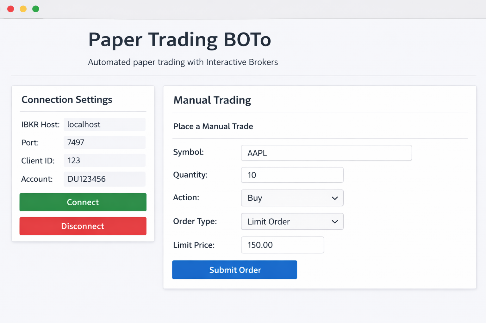

# Paper Trading BOTo

**Paper Trading BOTo** is a Python‑based algorithmic trading framework that connects to an Interactive Brokers paper trading account via the `ib_insync` API.  It was inspired by several open‑source IBKR trading projects and includes features gleaned from their commit histories, such as robust logging, database support, risk management, and easy extensibility.  The goal of BOTo is to provide a clear starting point for building, testing and analysing trading strategies in a paper environment before committing real capital.

## Why build this?

Open‑source IBKR trading projects illustrate how a simple strategy often grows into a complex system with features such as database logging, monitoring, email reporting and error handling.  For example, the **trading‑bot‑framework** repository added asynchronous PostgreSQL logging and improved historical data retrieval in a series of commits【735478255617264†L82-L89】【259634449855701†L83-L92】.  The **ibkr_trading_app** project evolved from a basic SPX strategy into a fully fledged application with environment configuration, email reporting and improved connection reliability【560845306289458†L185-L206】【157485389729687†L78-L83】.  By examining these histories we learned that:

* **Clear configuration and environment management** avoid accidental exposure of credentials.  The `trading‑bot‑framework` introduced a `.env.example` and automatic detection of PostgreSQL availability【6889114618198†L82-L90】【735478255617264†L82-L89】, while `ibkr_trading_app` restructured its project around an `.env` file and environment loader【797224965603579†L78-L88】.
* **Database and logging support** enable analysis and troubleshooting.  Commits added a comprehensive database schema, Grafana dashboards and unified logging across traders【6889114618198†L82-L90】.  Unified logging also simplifies debugging of asynchronous IBKR connections【730412866638135†L82-L90】.
* **Risk management and cost tracking** are essential.  Projects such as `quantum‑trader` provide risk limits, position sizing and drawdown protection【362023408974584†L165-L196】, while `ibkr_trading_app` enforces a 50 % cash reserve and price reasonability checks【560845306289458†L185-L206】.
* **User‑friendly reports and notifications** help traders monitor performance.  Commits in `ibkr_trading_app` added email summaries with attachments and market‑closed options to exit gracefully【157485389729687†L78-L83】【634560943035447†L147-L240】.

BOTo incorporates these lessons by providing a clean codebase with modular components, cost basis analysis and an extensible strategy interface.  The aim is not to provide a “holy‑grail” algorithm but to create a sandbox where you can safely develop and refine your ideas.

## Features

* **IBKR connection via `ib_insync`:**  A simple wrapper manages authentication and maintains a persistent connection to the Trader Workstation (TWS) or IB Gateway.  The implementation follows best practices such as enabling socket clients and using separate ports for paper (default `7497`) and live (default `7496`) trading.
* **Strategy framework:**  Implement your own strategies by subclassing the `BaseStrategy` class.  An example moving average crossover strategy is provided.  Strategies receive market data and submit orders via a safe execution layer.
* **Risk management:**  Position sizing, maximum portfolio exposure and stop‑loss/take‑profit orders are configurable.  The risk engine draws inspiration from the `quantum‑trader` risk management module【362023408974584†L165-L196】.
* **Cost basis analysis:**  BOTo tracks the average cost of open positions and computes realized and unrealized PnL.  This helps evaluate performance and make tax‑aware decisions.
* **Logging & optional database support:**  Transactions, orders and account balances are logged to standard output and optionally to a local SQLite database.  Following the pattern from `trading‑bot‑framework`【735478255617264†L82-L89】, the system auto‑detects database availability; if a database connection fails, logging continues to the console.
* **Reports:**  After each trading session the bot generates a CSV report summarizing trades, positions, cost basis and PnL.  A basic HTML report template is included to allow for email delivery or integration with custom dashboards.

* **Webhook microservice for TradingView and external signals:**  BOTo includes a standalone FastAPI service (`tradingview_service.py`) that listens for webhook alerts from TradingView or other systems and places market or limit orders on your IBKR paper account.  This allows you to leverage strategies defined in TradingView and route their signals to your IBKR account【289461129736191†L270-L294】.  The microservice follows a microservices pattern: it runs independently of the main bot, reads credentials from environment variables and can be deployed separately.

* **Trade any regular stock:**  The IBKR interface exposes `place_market_order` and `place_limit_order` methods that accept any ticker symbol, quantity and action.  Whether you want to trade equities, ETFs, or other instruments available via IBKR, you can do so by calling these functions directly or via the webhook service.  The generic order functions make the bot adaptable beyond the sample moving‑average strategy.

* **Streamlit dashboard:**  A Streamlit‑based user interface (`dashboard.py`) provides an approachable way for beginners to interact with the bot.  The dashboard allows you to connect and disconnect from your IBKR paper account, place manual market or limit orders, view a basic account summary, run a short SMA crossover session and inspect your trade history—all from a web browser.  This UI makes it easy to explore the system without writing code.

## Installation

### 1 – Prerequisites

1. **Interactive Brokers account:** Sign up for an IBKR account.  Paper trading requires enabling API access and disabling the “Read‑Only API” option in TWS or IB Gateway (see the IBKR documentation).
2. **Python ≥3.9** and `pip` installed on your machine.
3. **TWS or IB Gateway:** Download and install the Trader Workstation or Gateway, enable “ActiveX and Socket Clients” and note the paper trading port (default `7497`)【560845306289458†L275-L294】.

### 2 – Clone and install dependencies

```sh
git clone https://github.com/your‑username/paper‑trading‑boto.git
cd paper‑trading‑boto
python3 -m venv venv
source venv/bin/activate  # On Windows: venv\Scripts\activate
pip install -r requirements.txt
```

### 3 – Configuration

Copy the provided `.env.example` to `.env` and set your configuration variables:

```sh
cp .env.example .env
```

The most important variables are:

* `TWS_HOST`: host for TWS/Gateway (default `127.0.0.1`)
* `TWS_PORT`: paper trading port (default `7497`)
* `CLIENT_ID`: any integer (use a unique value per application)
* `ACCOUNT`: your IBKR paper account number (optional)
* `DB_PATH`: path to an SQLite database file for logging (optional)

### 4 – Running the bot

An example script (`bot.py`) is provided to run a moving average crossover strategy on a specified symbol in paper mode:

```sh
python bot.py --symbol AAPL --strategy sma_crossover --short_window 10 --long_window 30 --quantity 10
```

At the end of the session the script outputs a CSV report in the `reports/` directory.

## Running the TradingView webhook service

To integrate strategies from TradingView or other platforms, BOTo provides a webhook microservice.  Follow these steps:

1. **Set up environment variables.**  In your `.env` file set `TRADINGVIEW_SECRET` to a token of your choice.  Optionally set `DEFAULT_SYMBOL`, `DEFAULT_QUANTITY`, `DEFAULT_ORDER_TYPE` and `DEFAULT_LIMIT_PRICE` to provide fallbacks when fields are omitted in incoming webhook payloads.
2. **Start the FastAPI server.**  Activate your virtual environment and run:

   ```sh
   uvicorn paper_trading_boto.tradingview_service:app --host 0.0.0.0 --port 8000
   ```

   By default the service listens on port `8000` and exposes a single `/webhook` endpoint.
3. **Create a TradingView alert.**  In TradingView’s alert dialog, select “Webhook URL” and enter `http://your-server-address:8000/webhook`.  In the alert message body, send a JSON object such as:

   ```json
   {
     "secret": "<your TRADINGVIEW_SECRET>",
     "symbol": "AAPL",
     "action": "BUY",
     "quantity": 10,
     "order_type": "market"
   }
   ```

   For limit orders include a `limit_price` field and set `order_type` to `"limit"`.
4. **Test the webhook.**  You can manually test the endpoint using `curl` or Postman:

   ```sh
   curl -X POST http://localhost:8000/webhook \
     -H "Content-Type: application/json" \
     -d '{"secret": "your_secret_token", "symbol": "TSLA", "action": "SELL", "quantity": 5}'
   ```

   The service will validate the secret, connect to IBKR via `ib_insync` and place the specified order.

This microservice can be deployed separately from the main bot—on a different machine or container—and integrated with your choice of strategy platform.

## Running the Streamlit dashboard

To launch the graphical dashboard, first ensure you've installed the dependencies (including `streamlit`).  Activate your virtual environment and run:

```sh
streamlit run paper_trading_boto/dashboard.py
```

By default Streamlit will open a local web server at `http://localhost:8501`.  Use the sidebar to configure the IBKR connection.  Once connected you can place trades, refresh your account summary and start a simple SMA session.  When the session completes, the trade history table will display recorded trades.

### Using the dashboard

Below are annotated screenshots that illustrate how to use each part of the dashboard.  The examples use default values (AAPL as the symbol and a quantity of 10) and are intended to help beginners get comfortable with the interface.  These images were created for demonstration purposes; your own dashboard may look slightly different depending on your environment.

| Step | Description | Screenshot |
|----|----|----|
| **1 – Connect to IBKR and submit manual orders** | After launching the dashboard, first configure your IBKR connection in the sidebar (host, port, client ID and account).  Click **Connect** to establish a connection.  Once connected, the **Manual Trading** section becomes active.  Enter the stock symbol, quantity, choose BUY or SELL and select the order type (Market or Limit).  For limit orders, specify the limit price.  Click **Place Order** to send the trade to your paper account. |  |
| **2 – View account summary and configure the SMA strategy** | Use the **Refresh Summary** button to retrieve a snapshot of your account (cash, equity and margin).  To test the built‑in SMA crossover strategy, specify the strategy symbol, short and long windows, position size and session duration.  The bot will fetch market prices, compute moving averages and place trades when the crossover criteria are met.  Click **Start SMA Session** to begin the session. |  |

During a session the trade history table will populate with the date, symbol, action, quantity and price of each executed trade.  At the end of the session you can close the browser or disconnect via the sidebar.

## Project structure

```
paper_trading_boto/
├── bot.py                # Main entry point for running strategies
├── ibkr_interface.py     # Connection wrapper and API helper functions
├── strategy.py           # BaseStrategy and sample strategy implementations
├── risk_management.py    # Position sizing and stop‑loss/target logic
├── cost_basis.py         # Classes for tracking cost basis and PnL
├── reporting.py          # Report generation (CSV and HTML)
├── utils/logging_config.py # Logging configuration
├── .env.example          # Example environment configuration file
├── requirements.txt      # Python dependencies
├── README.md             # This documentation
├── FAQ.md                # Frequently asked questions and lessons learned
└── dashboard.py          # Streamlit dashboard for manual trading and SMA sessions
```

## Disclaimer

This software is for educational purposes only.  Algorithmic trading carries significant financial risk.  Always test strategies thoroughly in a paper trading environment and consult with a financial professional before live deployment.  The authors do not assume responsibility for losses incurred.